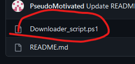
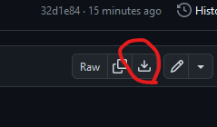
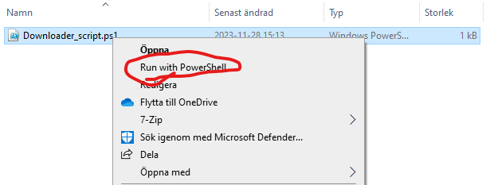
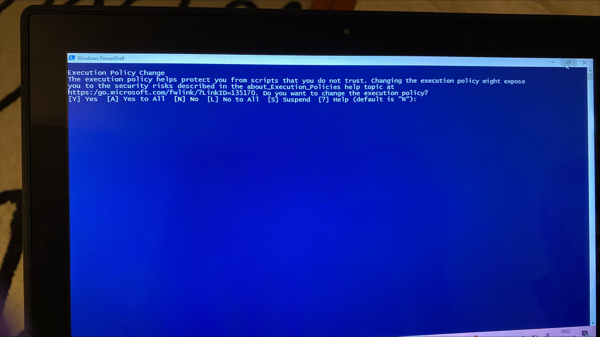

# About the script
This script downloads a portable java installation and a minecraft launcher called SKlauncher, which allows you to login offline and play minecraft for free. It also allows you to have multiple installations and easily mod your game.
## Usage 
1. Download the script by clicking `Downloader_script.zip` , clicking on the download button and then using. Put it wherever you want to download Minecraft. If you're unsure put it in your Documents folder. If your browser gives you a warning ignore it, the script is safe and you can look through it and the included files.

.. 

3. Right click the file and click `Run with powershell` .

The script will now start running, you should see a blue window and a bunch of numbers showing up. 
If you don't see that click the window with your cursor, click `crtl + c` , delete the `minecraft` folder in the directory you put the script and then run the script again.

- If you get this screen when you try to run the script, click `y` and then `enter` . This will tell the computer to give the script permission to do the things it needs to do.
- And if for whatever reason these steps don't work, such as because of some antivirus or some admin policy, or you get another security screen, try downloading the zip version, double clicking it, and then running the script from there.

4. When things stop happening, wait 10 seconds, and then close the blue window if it hasn't closed itself.
5. **In** the minecraft folder you will find a file called `starter.bat` or just `starter` . Put it on your desktop for convenience and double click it to start.
6. Wait until a window with a micorsoft login button appears, if you don't own the game use the offline mode option at the bottom of the screen.

Enjoy!
